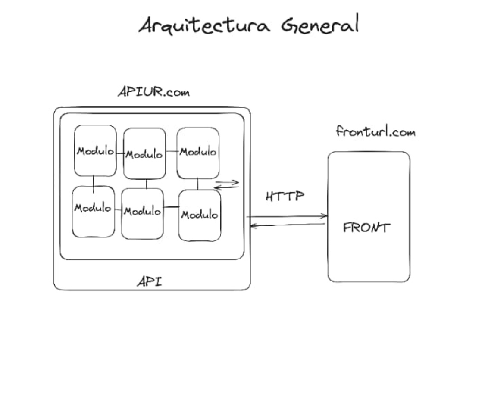
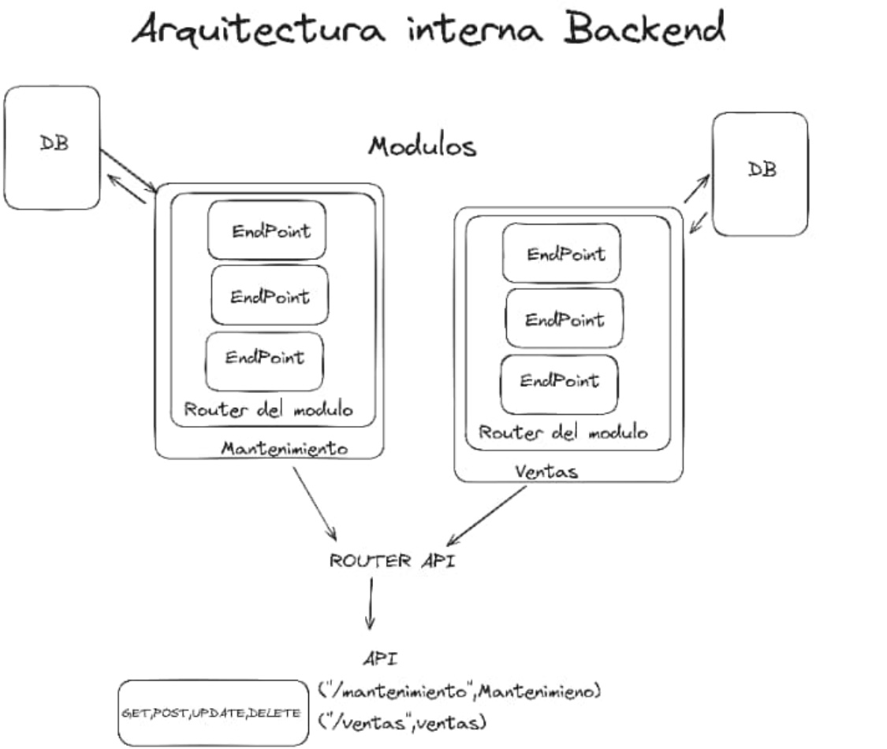
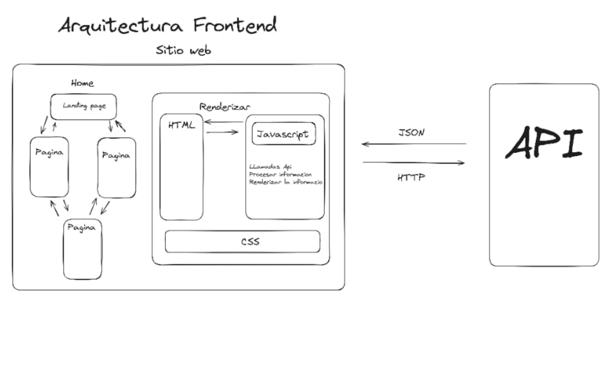

# TL;DR

El proyecto se fundamenta en la arquitectura de APIs para el despliegue y mantenimiento del módulo de cada departamento, de manera que los mismos sean implementados de manera independiente y la aplicación pueda ser utilizada aún con errores en alguno de los módulos.

Dicha arquitectura será posible por la implementación de una API general con la que se conectará cada módulo, y con la que se accederá a los datos que los mismos provean en el front.

   

# API 101

Una **API** (Application Programming Interface) se refiere a la implementación de métodos que son accesibles a través de una interfaz.

Dicha interfaz no se refiere a una **GUI** (Graphic User Interface), sino a un estilo de diseño en que podemos hacer uso de los métodos de un módulo o aplicación, sin necesidad de acceder o conocer su implementación, produciendo así una abstracción con la que cada parte de uno o varios programas puedan funcionar de manera independiente.

Dicha interfaz puede ser servida como módulos a importar en un programa, o como en nuestro caso, a través de métodos HTTP definidos, accesibles a través de _rutas_ o _endpoints_.

Dichos métodos HTTP serán definidos con **NodeJS**, que permite la implementación de algoritmos al que podemos asignarles su método HTTP y correspondiente endpoint.

 

# Arquitecturas implicadas en la aplicación

En primer lugar, está la arquitectura general arriba visible, con la que se puede ver la separación del backend y el frontend.

Para el **backend**, la idea es que construyamos los módulos como su propia API, con los métodos que dicho módulo requiera, y los que otros módulos puedan requerir.

Dicho módulo será conectado al enrutador (Router API) para que a través de ella los otros módulos puedan acceder a datos de módulos externos, y para que el front pueda interactuar con los diversos módulos aún cuando alguno de ellos no funcione del todo.

  

Para el **frontend**, la idea es general es en primer lugar construir la estructura y estilo de la página como si fuera estática, de manera que luego se pueda inyectar el HTML dinámico según los resultados de las llamadas a la API.

 

